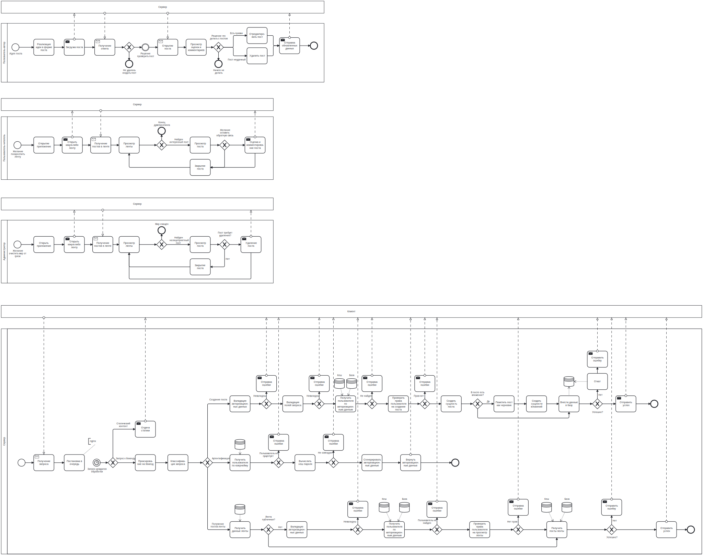

# DevSpark

Аггрегатор постов (статьи, документация, examples, библиотеки, проекты) на it-тематику с социальной составляющей (рейтинг и комментарии).

## Авторы (Командный проект)

Бакалдин Роман, Степаненко Андрей

## Идея

Приложение, позволяющее пользователям публиковать посты в тематических каналах, просматривать каналы или аггрегированные подборки других пользователей и оценивать посты путём голосования и комментариев.

## Стек

### Фронтенд
* [TypeScript](https://www.typescriptlang.org)
* [Vue.js](https://ru.vuejs.org)

### Бэкенд
* [Java 21](https://docs.oracle.com/javase/specs/jls/se21/html/index.html)
* [MongoDB](https://www.mongodb.com)

## Предметная область

Предметная область является результатом формализации исходной идеи (агрегатор постов) и включает в себя следующие сущности:

1. Пользователь (User) 
2. Тема (Topic)
3. Лента (Feed)
4. Канал (Channel)
5. Пост (Post)
6. Комментарий (Comment)

## Аналогичные решения

Решения, полностью подходяшего под озвученные требования, на данный момент не существует, поэтому сравнение будет выполняться среди сервисов, позволяющих частично получить необходимый функционал. Используются следующие критерии:

- Тематика сервиса (Направленность)
- Формат контента (Контент)
- Средства катологизации (Катологизация)
- Возможность организовать и настроить ленту постов (Фильтрация)
- Социальная составляющая (Оценки)

| Решение   | Направленность | Контент                      | Катологизация    | Фильтрация           | Оценки                |
|-----------|----------------|------------------------------|------------------|----------------------|-----------------------|
| Pinterest | Фотохостинг    | Фотографии с описанием       | Коллекции и теги | Только поиск         | Рейтинг и комментарии |
| Habr      | IT             | Только развернутые статьи    | Только теги      | Поиск, темы и теги   | Рейтинг и комментарии |
| Github    | IT             | Репозитории с исходным кодом | Только теги      | Поиск и теги         | Рейтинг в виде звёзд  |
| Dzen      | Хостинг блогов | Статьи и опросы              | Отсутствует      | Только поиск         | Рейтинг и комментарии |
| Codepen   | IT, Frontend   | Скетчи на HTML + CSS + JS    | Коллекции        | Только поиск         | Рейтинг и комментарии |
| JSFiddle  | IT, Frontend   | Скетчи на HTML + CSS + JS    | Отсутствует      | Отсутствует          | Отсутствует           |
| Pastebin  | IT             | Любой текст                  | Отсутствует      | Только поиск         | Отсутствует           |
| DevSpark  | IT             | Любой формат постов          | Коллекции и теги | Поиск, теги, рейтинг | Рейтинг и комментарии |

## Актуальность

На данный момент фактически не существует сервиса, предоставляющего разработчикам возможность как вести "записную книжку" в удобном свободном формате, так и делиться своими проектами или библиотеками для распространения в комьюнити и получения фидбека. Кроме того, остаётся свободной так востребованная в последние годы ниша бесконечной ленты коротких тематических постов. Таким образом, учитывая отсутствие прямых конкурентов, схожий с уже ставшим успешным сервисом Pinterest формат и обширный набор функционала, позволяющий как вести собственную коллекцию идей, так и публиковать доступный другим пользователям контент, можно считать идею актуальной и рассматривать для реализации.

## Акторы и роли

`Гость` - пользователь, обладающий возможностью просматривать любой публичный контент и имеющий доступ к регистрации. Не требует авторизации.

`Пользователь` - зарегистрированный пользователь, обладающий доступом к профилю. Требует авторизации.

`Пользователь-читатель` - пользователь, обладающий доступом к просмотру любого публичного контента, доступом к созданию, редактированию и удалению лент, доступом к оценке постов и комментариев, а также доступ к созданию, изменению и удалению своих комментариев. Требует авторизации.

`Пользователь-автор` - пользователь, обладающий доступом к созданию, настройке приватности и удалению канала, доступом к созданию, изменению и удалению постов. Требует авторизации.

`Администратор` - пользователь, обладающий доступом к модификации любого контента на сайте. Также способен создавать и удалять темы (topic). Требует авторизации.

`Система` - служебный пользователь, обладающий доступом к созданию контента, а также модификации существующего. Доступ только со стороны сервера.

## UseCase-диаграмма

## ER-диаграмма

## Пользовательские сценарии

### Создание поста
Пользователь: *Пользователь-автор*

1. Авторизоваться в сервисе
2. Перейти в профиль
3. Нажать на кнопку "добавить пост"
4. Заполнить данные поста: заголовок, текст поста, канал и т.д.
5. Подтвердить создание поста
6. Получить уведомление об успешности/неуспешности действия

### Создание ленты
Пользователь: *Пользователь-читатель*

1. Авторизоваться в сервисе
2. Перейти в профиль
3. Нажать на кнопку "добавить ленту"
4. Заполнить название и какие теги, топики(темы), каналы должны содержаться в ленте
5. Подтвердить создание ленты
6. Получить уведомление об успешности/неуспешности действия

### Просмотр канала
Пользователь: *Пользователь-читатель*

1. Авторизоваться в сервисе
2. Перейти в профиль к любому пользователю
3. Нажать на любой из его публичных каналов
4. Просмотреть посты, содержащиеся в канале

### Комментирование поста из свой ленты
Пользователь: *Пользователь-читатель*

1. Авторизоваться в сервисе
2. На домашней странице выбрать какую ленту он хочет просматривать
4. Просмотреть посты, содержащиеся в ленте
5. Выбрать понравившийся пост
6. Поставить оценку посту (опционально)
7. Написать комментарий в поле ввода под постом
8. Подтвердить отправку комментария
9. Получить уведомление об успешности/неуспешности действия

### Создание топика (темы)
Пользователь: *Администратор*

1. Авторизоваться в сервисе
2. Перейти в профиль
3. Нажать на кнопку "добавить топик"
4. Заполнить название и теги топика
5. Подтвердить создание топика
6. Получить уведомление об успешности/неуспешности действия

### Удаление поста админом
Пользователь: *Администратор*

1. Авторизоваться в сервисе
2. Перейти на страницу нелецеприятного поста каким угодно способом
3. Нажать на кнопку "удалить пост"
6. Получить уведомление об успешности/неуспешности действия

## Формализация бизнес-процессов (BPMN)

